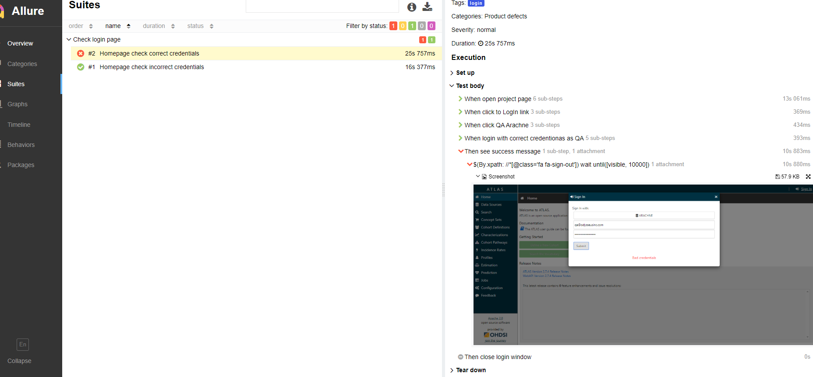

# AtlasTests

### Common and configuration

Clone this project to your computer.

Create file **application.properties** in _src_ directory with parameters:

- login
- password
- downloadpath
- test.mode  
- test.browser 
- link
- headless
- e.g.


_login_ and _password_ is Atlas account for tests

_downloadpath_ is a directory to save files (Note: directory should be exist)

_test.mode_ local or remote

_test.browser_

_link_ is link to test environment

_headless_ false by default, you can configure it

You can run tests in a local browser or remote Selenium Server

- for **local** mode is specifying path to browser driver, like _src/chromedriver.exe_
- for **remote** mode is specifying URL for Selenium Server, like _http://127.0.0.1:4444/wd/hub_ 
(note: instruction for setup and configure Selenoide described in section "Setup and configure Selenoide") 

**Requirements for running test**

I need installed JDK and Apache Maven 

### Setup and configure Selenoide

Selenoide is Selenium Server in docker. 

For remote mode recommended using Selenoide
 
1. Install docker and add user to docker group
2. Install Configuration Manager (CM)

`curl -s https://aerokube.com/cm/bash | bash`

Put cm to /usr/local/bin

3. Configure of CM

`cm selenoid configure --vnc --browsers chrome --last-versions 1 --tmpfs 128`

Note: see https://aerokube.com/cm/latest/ for more information about configure CM

Pull docker without vnc
`docker pull selenoid/chrome:73.0`

4. Run CM

`cm selenoid start --vnc`

5. Run Selenoid Interface (optional)

`cm selenoid-ui start`

### Running test with IntelliJ Idea
To start you have to install cucumber plugin to IntelliJ Idea: https://plugins.jetbrains.com/plugin/7212-cucumber-for-java
Please take attention on version of your Idea, to download correct version of plugin. (Help -> About)

To run tests you have to run RunCucumberTest.class file
If you start it as is, all tests from project start.
You can say to cucumber what tests do you want to start by uncommenting row ", tags = {"@dev"}"
after  @ you have to set tag with type of tests what you want. e.g. @IMPALA and start RunCucumberTest and all tests with
tag IMPALA will be start.

### Running test from CLI
For running test on Unix you should go to AtlasTests directory with pom.xml and execute command:

`mvn clean test` 

for running tests which specified in _CucumberOptions_ section in _RunCucumberTest.java_
 
or 

`mvn clean test -Dcucumber.options="src/test/resources/odysseusAT --tags @unauthorized"`

for running tests with tag _@unauthorized_

### Test data from properties
You can use your own test data from application.properties, just add fields(example):
```
profile = IMPALA
source = Netezza CDM5.3
report = Procedure
```

and run command:
`mvn clean test -Dcucumber.options="src/test/resources/odysseusAT --tags @owndatatestsfromproperty"`
but it's not possible to set the list of sources for example, because cucumber doesn't support iterations 

### Allure report
For generating allure report after test's running you should execute the command:

`mvn site` 

After that just open:
target\site\allure-maven-plugin\index.html

 
  Allure report
 